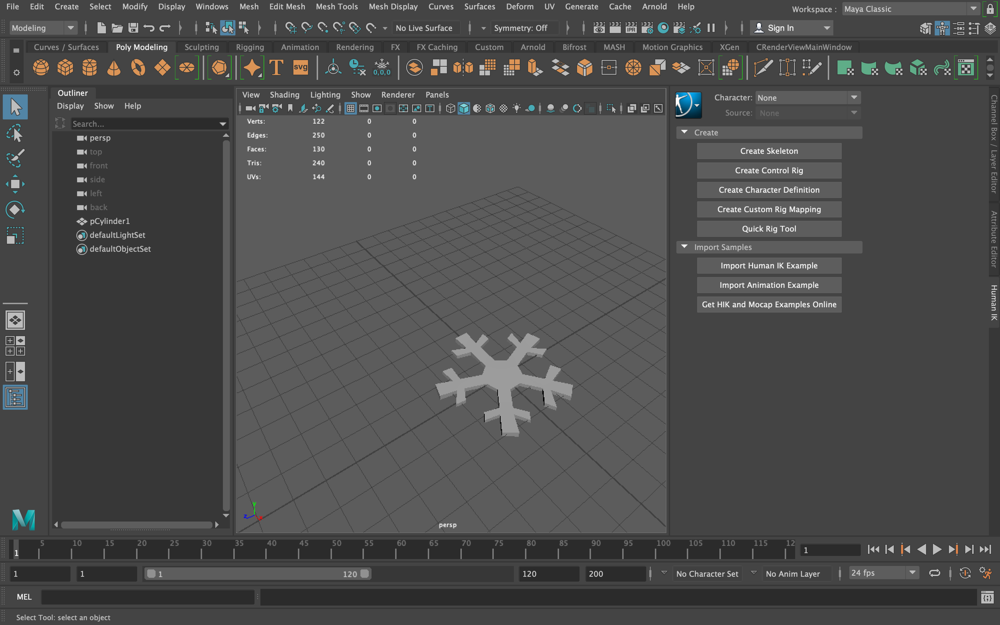

# NakedOptics-InstagramFilter-millig

## Project Description
Create an InstagramFilter for NakedOptics with SparkAR and Maya

## Visuals

## Concept
+ Small snowflakes fly around the glasses and appear next to your eyes when you blink
+ The color of the material changes when you open your mouth

### Idea

### References
+ https://youtu.be/_B0G1jIaxMA - face tattoos			
+ https://youtu.be/OHBQYAr79Dc - animate an effect that divides the face into 4 parts	
+ https://youtu.be/RapfrXtyliU - create some colored light reflections on your face 	
+ https://youtu.be/idUij9qtHko - particles come out of your eyes/mouth when you blink/ open your mouth 				
+ https://youtu.be/HYQ_Kzyygk8 - tutorial: particle systems and 3d objects from maya	
+ https://youtu.be/P6kZl8-QzUU - rotate an object around your head	
+ https://youtu.be/mIt2fdjExy0 - create a filter with glasses
+ https://youtu.be/_BHo-QcQbgU - "Who / What are you?" Random Filter
+ https://youtu.be/LDbmH8pyjjY - filter with glasses

